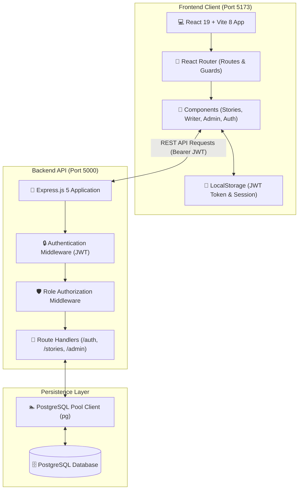

# 📚 Story Platform - Full-Stack Story Sharing Platform with RBAC

[](LICENSE)
[](https://nodejs.org/)
[](https://react.dev/)
[](https://vitejs.dev/)
[](https://expressjs.com/)
[](https://www.postgresql.org/)
[](https://jwt.io/)

A modern, full-stack digital storytelling platform built with React 19, Express 5, and PostgreSQL. Features granular Role-Based Access Control (RBAC), secure JWT authentication, rich story publishing, and responsive reader-friendly interfaces.

---

## 📑 Table of Contents

- [✨ Features](#-features)
- [🏗️ System Architecture](#️-system-architecture)
- [🛡️ Role-Based Access Control (RBAC)](#️-role-based-access-control-rbac)
- [🛠️ Tech Stack](#️-tech-stack)
- [📂 Project Structure](#-project-structure)
- [🗄️ Database Schema](#️-database-schema)
- [🔌 API Endpoints](#-api-endpoints)
- [🚀 Getting Started](#-getting-started)
  - [Prerequisites](#prerequisites)
  - [1. Clone the Repository](#1-clone-the-repository)
  - [2. Backend Setup](#2-backend-setup)
  - [3. Frontend Setup](#3-frontend-setup)
- [🧪 Testing the Authentication & Story Flow](#-testing-the-authentication--story-flow)
- [⚙️ Environment Configuration](#️-environment-configuration)
- [📜 Available Scripts](#-available-scripts)
- [🗺️ Roadmap](#️-roadmap)
- [🤝 Contributing](#-contributing)
- [📄 License](#-license)

---

## ✨ Features

- **🛡️ Granular Role-Based Access Control (RBAC)**: Strict permission hierarchy distinguishing Readers (`user`), Writers (`writer`), and Administrators (`admin`).
- **🔐 Secure Authentication**: Passwords hashed with `bcryptjs` (salt rounds: 10) and stateless session authorization via signed JSON Web Tokens (JWT).
- **✍️ Creator Workflow**: Dedicated publishing suite for verified writers to draft, categorize, and publish stories.
- **📖 Curated Story Feed & Recommendations**: Category filtering (Fiction, Technology, Inspiration, Mystery) and tailored book recommendations.
- **⚡ High-Performance React 19 Client**: Built on Vite 8 with React Router client-side routing, optimistic state management, and accessible form controls.
- **💾 PostgreSQL Relational Persistence**: ACID-compliant persistence with connection pooling (`pg.Pool`), foreign key cascade constraints, and automated table provisioning.
- **🎨 Responsive Design System**: Modern CSS variables architecture with dark/light mode token support, smooth animations, and mobile responsiveness.

---

## 🏗️ System Architecture

The application decouples client rendering from backend business logic and persistence using REST APIs and JWT bearer authorization:



---

## 🛡️ Role-Based Access Control (RBAC)

The platform enforces strict permissions at both the backend route level and frontend navigation level:

| Role | Browse & Read Stories | Submit New Stories | Edit Stories | Admin Management |
| :--- | :---: | :---: | :---: | :---: |
| **`user` (Reader)** | ✅ Yes | ❌ No | ❌ No | ❌ No |
| **`writer` (Author)** | ✅ Yes | ✅ Yes | ✅ Yes (Own Stories) | ❌ No |
| **`admin` (Administrator)** | ✅ Yes | ❌ No | ✅ Yes (All Stories) | ✅ Full Access |

---

## 🛠️ Tech Stack

### Frontend (`frontend/`)
| Technology | Description |
| :--- | :--- |
| **React 19** | Modern component-based declarative UI library |
| **Vite 8** | Next-generation lightning-fast frontend tooling |
| **React Router** | Client-side routing and declarative route guards |
| **Vanilla CSS** | Modern design token system using CSS custom properties |
| **ESLint** | Code quality analysis and React Hooks verification |

### Backend (`backend/`)
| Technology | Description |
| :--- | :--- |
| **Node.js** | Server-side JavaScript runtime environment |
| **Express 5** | Minimalist web application framework for REST APIs |
| **PostgreSQL** | Enterprise-grade open-source relational database |
| **`pg` (node-postgres)** | PostgreSQL client and connection pooling for Node.js |
| **JSON Web Token (JWT)** | Stateless, token-based authorization and session verification |
| **Bcrypt.js** | Cryptographic salted password hashing |
| **CORS** | Cross-Origin Resource Sharing security configuration |
| **Dotenv** | Zero-dependency environment variable loader |

---

## 📂 Project Structure

```text
storyplatformpractice/
├── backend/                    # Express.js REST API server
│   ├── config/
│   │   └── db.js               # PostgreSQL connection pool & table bootstrap
│   ├── database/
│   │   └── db.js               # Alternative database & router script
│   ├── middleware/
│   │   └── auth.js             # JWT authentication & RBAC authorization middleware
│   ├── .env.example            # Backend environment variables template
│   ├── index.js                # Server entry point, middleware & route definitions
│   └── package.json            # Backend dependencies & npm scripts
│
├── frontend/                   # React 19 + Vite client
│   ├── public/                 # Static assets & icons
│   ├── src/
│   │   ├── components/
│   │   │   ├── About.jsx       # Platform vision & technology description
│   │   │   ├── Admin.jsx       # Admin management panel
│   │   │   ├── BookRec.jsx     # Curated reading recommendations
│   │   │   ├── Home.jsx        # Landing hero & feature showcase
│   │   │   ├── Login.jsx       # User authentication (Login & Register toggle)
│   │   │   ├── Navbar.jsx      # Navigation header & active session indicator
│   │   │   ├── Registration.jsx# Dedicated registration interface
│   │   │   ├── Stories.jsx     # Story feed & creator publishing view
│   │   │   └── Writer.jsx      # Writer draft submission workspace
│   │   ├── App.jsx             # Top-level routing & session management
│   │   ├── App.css             # Component-level layout & interactive styles
│   │   ├── index.css           # Global typography, color schemes & themes
│   │   └── main.jsx            # Application root mounting with React DOM
│   ├── index.html              # HTML entry point
│   ├── vite.config.js          # Vite build & plugin configuration
│   └── package.json            # Frontend dependencies & npm scripts
│
├── package.json                # Root workspace scripts (backend & frontend orchestration)
└── README.md                   # Project documentation
```

---

## 🗄️ Database Schema

The database model is structured in PostgreSQL with foreign keys and cascade deletions:

```sql
-- Users Table with Role Attribution
CREATE TABLE IF NOT EXISTS users (
  id SERIAL PRIMARY KEY,
  username VARCHAR(100) UNIQUE NOT NULL,
  password VARCHAR(255) NOT NULL,
  role VARCHAR(50) DEFAULT 'user' CHECK (role IN ('user', 'writer', 'admin')),
  created_at TIMESTAMP WITH TIME ZONE DEFAULT CURRENT_TIMESTAMP
);

-- Stories Table linked to Author
CREATE TABLE IF NOT EXISTS stories (
  id SERIAL PRIMARY KEY,
  title VARCHAR(255) NOT NULL,
  content TEXT NOT NULL,
  category VARCHAR(100) DEFAULT 'General',
  author_id INTEGER REFERENCES users(id) ON DELETE CASCADE,
  author_username VARCHAR(100) NOT NULL,
  created_at TIMESTAMP WITH TIME ZONE DEFAULT CURRENT_TIMESTAMP
);
```

- **`users`**: Stores credentials with bcrypt hash, unique username, and permission role (`user`, `writer`, `admin`).
- **`stories`**: Contains published story text, categorized tags, creation timestamp, and foreign key reference to the author.

---

## 🔌 API Endpoints

### Authentication Routes
| Method | Endpoint | Access | Description |
| :--- | :--- | :--- | :--- |
| `POST` | `/api/auth/register` | Public | Register a new user account with hashed password |
| `POST` | `/api/auth/login` | Public | Authenticate credentials and return signed JWT token |
| `GET` | `/api/auth/me` | Authenticated | Retrieve current session profile and role permissions |

### Story Routes & RBAC Guards
| Method | Endpoint | Access / Role | Description |
| :--- | :--- | :--- | :--- |
| `GET` | `/api/stories` | `user`, `admin` | Fetch list of published stories |
| `GET` | `/api/stories/:id` | `user`, `admin` | Retrieve full details of a specific story |
| `POST` | `/api/stories` | `writer` only | Publish a new story (author ID tied to JWT) |
| `PUT` | `/api/stories/:id` | `writer`, `admin` | Update an existing story (writers edit own; admins edit all) |
| `DELETE` | `/api/stories/:id` | `admin` | Remove a story from the platform |

---

## 🚀 Getting Started

Follow these steps to run the application locally.

### Prerequisites

Ensure you have the following installed on your machine:
- [Node.js](https://nodejs.org/) (`v18.0.0` or higher)
- [npm](https://www.npmjs.com/) (`v9.0.0` or higher)
- [PostgreSQL](https://www.postgresql.org/) (`v14.0.0` or higher)
- [Git](https://git-scm.com/)

---

### 1. Clone the Repository

```bash
git clone https://github.com/khananzarali/storyplatformpractice.git
cd storyplatformpractice
```

---

### 2. Backend Setup

1. Open a terminal and navigate to the `backend` directory:
   ```bash
   cd backend
   ```

2. Install backend dependencies:
   ```bash
   npm install
   ```

3. Configure environment variables:
   Create a `.env` file in the `backend/` directory based on `.env.example`:
   ```env
   PORT=5000
   JWT_SECRET=your_super_secret_jwt_key_here
   DB_USER=postgres
   DB_HOST=localhost
   DB_NAME=storyplatform
   DB_PASSWORD=your_postgres_password
   DB_PORT=5432
   ```

4. Create the PostgreSQL database:
   ```sql
   CREATE DATABASE storyplatform;
   ```

5. Start the backend server:
   ```bash
   npm run dev
   ```

   The server will start listening on `http://localhost:5000`:
   ```text
   Database tables verified/initialized successfully.
   Server is running on http://localhost:5000
   ```

---

### 3. Frontend Setup

1. Open a second terminal window and navigate to the `frontend` directory:
   ```bash
   cd frontend
   ```

2. Install frontend dependencies:
   ```bash
   npm install
   ```

3. Start the Vite development server:
   ```bash
   npm run dev
   ```

4. Open your browser and navigate to:
   ```text
   http://localhost:5173
   ```

---

## 🧪 Testing the Authentication & Story Flow

To verify Role-Based Access Control and story lifecycle:

1. **Register a Reader Account**:
   - Go to `http://localhost:5173/login`, select **Register**, and create a standard reader account.
   - Reader can view stories on `/stories` but will not have access to authoring tools.
2. **Register a Writer Account**:
   - Register an account with `role: "writer"`.
   - Log in and navigate to `/stories` or `/writer` to draft and publish a story.
   - Verify that the new story instantly appears on the story feed.
3. **Verify Token Persistence**:
   - Refresh the page or open a new tab; your JWT authentication token in `localStorage` preserves the session.
4. **Logout & Session Termination**:
   - Click the **Logout** button in the navigation header to clear credentials and return to public mode.

---

## ⚙️ Environment Configuration

### Backend (`backend/.env`)
| Variable | Default | Description |
| :--- | :--- | :--- |
| `PORT` | `5000` | Port on which the Express REST API server listens. |
| `JWT_SECRET` | `story_platform_super_secret_key_2026` | Secret key used to sign and verify JWT tokens. |
| `DB_HOST` | `localhost` | PostgreSQL host address. |
| `DB_PORT` | `5432` | PostgreSQL port. |
| `DB_USER` | `postgres` | Database username. |
| `DB_PASSWORD` | `postgres` | Database password. |
| `DB_NAME` | `storyplatform` | Target database name. |

---

## 📜 Available Scripts

### Root Workspace (`package.json`)
- `npm run backend` — Starts the backend server with hot-reloading (`node --watch`).
- `npm run frontend` — Starts the Vite frontend development server.

### Backend (`backend/package.json`)
- `npm start` — Runs the Express server in production mode.
- `npm run dev` — Runs the Express server with automatic file watching.

### Frontend (`frontend/package.json`)
- `npm run dev` — Starts the Vite dev server with Hot Module Replacement (HMR).
- `npm run build` — Compiles optimized production static assets into `dist/`.
- `npm run preview` — Previews the built production application locally.
- `npm run lint` — Analyzes JavaScript and JSX files with ESLint.

---

## 🗺️ Roadmap

- [ ] **Rich-Text Markdown Editor**: Integrated WYSIWYG / Markdown editor with live preview for story writers.
- [ ] **Reader Bookmarks & Likes**: Save favorite stories to personal reading lists with claps/likes.
- [ ] **Comment & Discussion Threads**: Nested comment section for interactive reader feedback.
- [ ] **AI-Powered Book Recommendations**: Personalized story recommendations based on reading history.
- [ ] **Dark & Light Mode Switcher**: Seamless theme toggling with persistent user preference.
- [ ] **Author Follow & Notifications**: Follow favorite creators and receive alerts for new releases.

---

## 🤝 Contributing

Contributions, issues, and feature requests are welcome!

1. Fork the Project
2. Create your Feature Branch (`git checkout -b feature/AmazingStoryFeature`)
3. Commit your Changes (`git commit -m "feat: add AmazingStoryFeature"`)
4. Push to the Branch (`git push origin feature/AmazingStoryFeature`)
5. Open a Pull Request

---

## 📄 License

Distributed under the **MIT License**. See [`LICENSE`](LICENSE) for more information.
